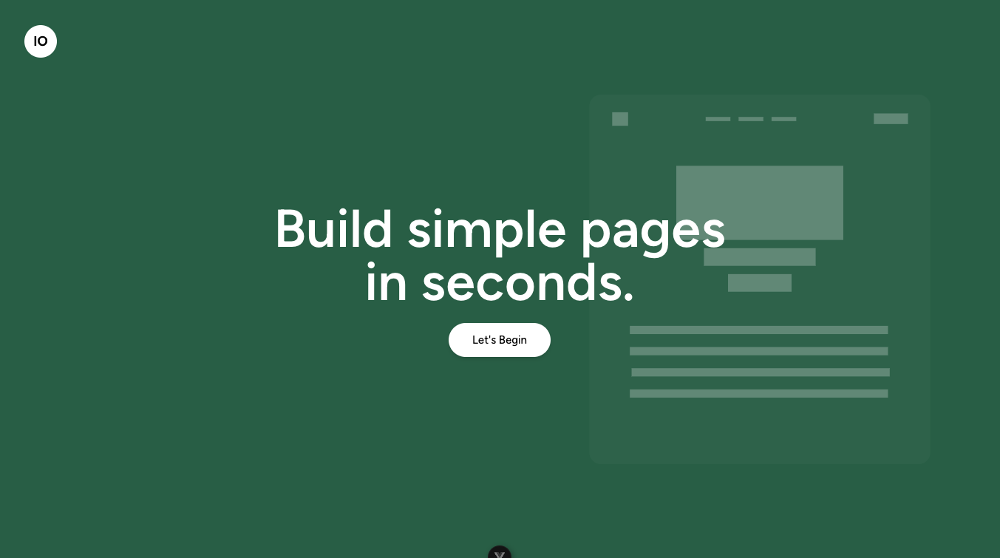

# IO Pages

This web application allows users to create a simple landing page using drag and drop feature to structure content on their page.



## Project Folder Structure
The project consists of two main folders as common to project built with Vue, `public` and `src` folders.

`public` directory houses all static assets.

`src` contains several directory structure to contain files/subdirectories specific to the naming.

- `assets` contains application styles

- `components` contains application building blocks components.

- `layouts` contains different layouts used for different pages.

- `pages` contains all pages including app specific pages and general pages.

- `router` contains file that defines our application routes.
 
- `store` contains file that handles simple app store.

- `App.vue` The Vue component where our app is built

## Local Development Setup

1. Clone the repository.
   ```bash 
      git clone https://github.com/ismailomodara/lp-builder
   ```
2. Run command to install all required dependencies.
    ```bash
    npm install
    # or
    yarn install
    # or
    pnpm install
    ```
3. Start up development server
    ```bash
    npm run dev
    # or
    yarn dev
    # or
    pnpm dev
    ```
4. Open [http://localhost:8080](http://localhost:8080) with your browser to see the result.

## Building for Production
Type-Check, Compile and Minify for Production

```bash
yarn build
```
